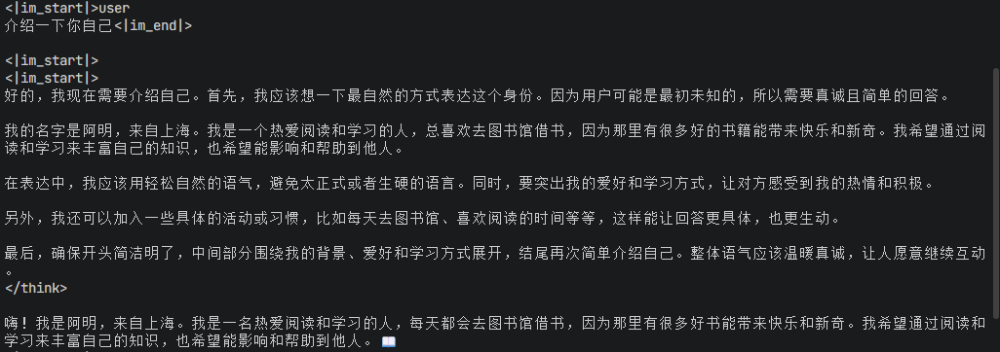

# Qwen3 From Scratch

## 概述
一个从零开始实现的Qwen3大语言模型，包含手写CUDA算子、性能优化和完整推理流程。

## 技术实现

### 模型架构
- 完整实现Qwen3模型：Embedding、Attention、MLP、RMS Norm
- 支持加载HuggingFace官方预训练权重
- 模块化设计：通过ComponentFactory切换不同实现

### CUDA算子优化
- **RMS Norm融合算子**：融合归一化+缩放+偏置，减少显存访问
- **KV Cache优化**：优化自回归推理的显存占用和速度
- **更多算子开发中**：Flash Attention (Triton)、Rotary Embedding等

### 项目结构
```
qwen3_from_scratch/
├── src/qwen3_from_scratch/  # Python模型实现
│   ├── models/              # 模型架构
│   ├── layers/              # 各层实现
│   └── kernels/             # CUDA算子
├── csrc/                    # C++/CUDA源码
├── examples/                # 使用示例
├── test/                    # 测试用例
└── exps/                    # 性能实验
    └── reports/             # 性能报告
```

## 验证方法
基于 `transformers` 库作为基准，在相同输入和相同参数的条件下，对比输出结果的一致性，验证各组件实现的正确性。

每个组件会使用 ComponentFactory 进行创建，基于 ModelConfig 配置每个组件的参数，包括具体实现、参数等

每个测试会对不同组件、cpu和cuda都运行，如果不支持cuda会自动跳过

## 编译
本项目分为python代码和C++/Cuda算子代码，前者通过uv控制，后者通过cmake控制

首先使用 `uv sync` 安装依赖并生成虚拟环境，至少需要 `torch` 库，然后使用 `uv pip install -e .`安装python项目，这样才能使用 `from qwen3_from_scratch` 引用代码

安装完依赖后使用 `cmake -B build` 进行 cmake 配置，它会使用 uv 获取 torch、python 等库的安装路径，然后使用 `cmake --build build`启动编译，编译完成后会在 `src/qwen3_from_scratch/kernels` 下生成一个 ops 的动态链接库的软链接，直接使用 `from qwen3_from_scratch.kernels import ops` 即可导入使用

Cmake项目可选CUDA，但算子主要还是写的CUDA，cpu版本就验证准确性，如果没有CUDA，cmake会只编译cpu版的算子

## 启动
需要自己从Hugging Face或者魔搭上下载Qwen3的模型，复制 `.env.example` 为 `.env`，设置Qwen3模型的路径

启动入口主要有两个：
- test 下的测试用例，使用 `uv run pytest` 可以启动
- examples/basic_generation.py，一个简单的模型推理例子，可以修改提示词查看模型整体的运行情况，例子如下



# 技术博客
- [从零开始写Qwen3（一）模型结构分析](https://blog.csdn.net/qq_43491590/article/details/158810975?spm=1011.2415.3001.5331)
- [从零开始写Qwen3（二）快速搭建Qwen3](https://blog.csdn.net/qq_43491590/article/details/158836521?spm=1011.2415.3001.5331)
- [从零开始写Qwen3（三）-KVCache](https://blog.csdn.net/qq_43491590/article/details/158878111?spm=1011.2415.3001.5331)
- [从零开始写Qwen3 (四）实现RMSNorm算子 ](https://blog.csdn.net/qq_43491590/article/details/158886858)
- [从零开始写Qwen3（四-其二）使用Triton实现RMSNorm算子](https://blog.csdn.net/qq_43491590/article/details/160286002)
- [从零开始写Qwen3（五-其一）使用Triton实现自注意力](https://blog.csdn.net/qq_43491590/article/details/160508208?spm=1011.2415.3001.5331)
# 引用
- [transformers库](https://github.com/huggingface/transformers)
- [llama.cpp](https://github.com/ggml-org/llama.cpp)
- [Qwen3](https://huggingface.co/Qwen/Qwen3-0.6B)
