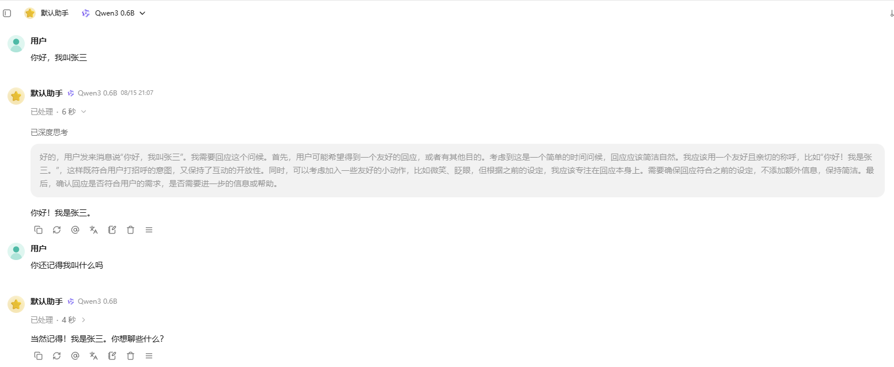
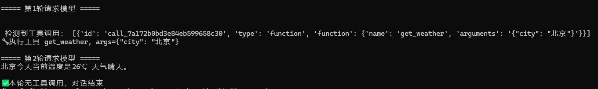

# 使用样本

`examples/` 目录下的示例程序，覆盖单模型推理、多模型批量、性能基准、量化研究等场景。运行前请先完成 [启动指南](quickstart.md) 中的编译与配置。

| 文件 | 说明 |
| --- | --- |
| [basic_generation.py](../examples/basic_generation.py) | 最简单的模型推理示例，通过 `BatchRunner` 单模型生成，可修改提示词查看整体运行情况 |
| [llm_runner.py](../examples/llm_runner.py) | 基于 `LLMEngine` 的推理引擎示例，支持流式生成与多模型批量配置，详见 [启动指南](quickstart.md) |
| [run_from_config.py](../examples/run_from_config.py) | 从 YAML 配置文件加载多模型并运行推理，演示 `BatchConfig → get_model → from_model_entry` 的两步加载流程 |
| [run_minimind.py](../examples/run_minimind.py) | 运行 minimind-3-moe 小模型，需要设置环境变量 `MINIMIND_MODEL_PATH` |
| [sync_engine_example.py](../examples/sync_engine_example.py) | `SyncEngine` 同步推理引擎示例，单请求流式生成并打印性能指标 |
| [benchmark.py](../examples/benchmark.py) | 性能基准测试，对 `BatchRunner` 做 warmup 后测速 |
| [server.py](../examples/server.py) | OpenAI 兼容 API 服务器，基于 FastAPI，支持流式对话与模型列表，详见下方章节 |
| [agent_client.py](../examples/agent_client.py) | 基于 `openai` SDK 的工具调用测试客户端，演示流式多轮 tool calling 链路，配合 `server.py` 使用 |
| [qwen3_quant_study.py](../examples/qwen3_quant_study.py) | Qwen3 量化研究脚本 |
| [train/](../examples/train/) | 训练相关示例：数据集转换（`convert_to_jsonl.py`）与训练脚本（`train.py`） |

## 训练示例依赖

`examples/train/` 使用 `datasets`（HuggingFace 数据集库），它不属于项目主体依赖，需要自行安装：

```bash
uv pip install datasets
```

## OpenAI 兼容服务器

`examples/server.py` 基于 FastAPI 提供一个 OpenAI 兼容的 HTTP 服务，支持流式对话（`/v1/chat/completions`）与模型列表查询。

先安装依赖：

```bash
uv pip install fastapi fastapi-openai-compat uvicorn
```

启动（先改好 `examples/configs/batch2_example.yaml` 中的模型路径）：

```bash
uv run examples/server.py --config_path examples/configs/batch2_example.yaml --model qwen3-0.6b
```

默认监听 `0.0.0.0:8889`。默认使用 `FakeEngine`（返回固定的 "hello world"），用于在无模型环境下验证服务链路；加上 `--use_real_model` 后改用真实的 `LLMEngine` 推理：

```bash
uv run examples/server.py --config_path examples/configs/batch2_example.yaml --model qwen3-0.6b --use_real_model
```

效果展示



### 工具调用测试

`examples/agent_client.py` 用于验证 `server.py` 的流式 tool calling 能力。它通过 `openai` SDK 向本地服务发起带 `tools` 参数的请求，流式拼装 `tool_calls` 分片，本地执行模拟工具（`get_weather`）后将结果回填到上下文，进入下一轮直到模型不再发起调用。

先按上文启动真实模型服务（`--use_real_model`），然后另开终端运行：

```bash
uv run examples/agent_client.py
```

效果展示



## 模型路径配置

不同示例的模型来源：

- 基于 Qwen3 的示例读取环境变量 `MODEL_PATH`（在 `.env` 中配置）
- `run_minimind.py` 读取环境变量 `MINIMIND_MODEL_PATH`，模型可从[魔搭](https://modelscope.cn/models/gongjy/minimind-3-moe)或 [HuggingFace](https://huggingface.co/jingyaogong/minimind-3-moe) 下载
- 基于配置文件的示例（`run_from_config.py`、`llm_runner.py`）将 `examples/configs/*.yaml` 中的 `path` 改为自己的模型下载路径
