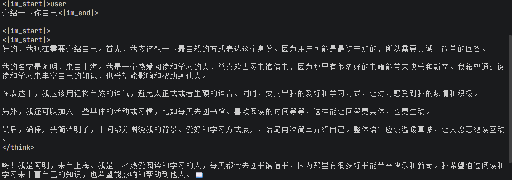

# 启动指南

## 编译

本项目分为 Python 代码和 C++/Cuda 算子代码，前者通过 `uv` 控制，后者通过 `cmake` 控制。

首先使用 `uv sync` 安装依赖并生成虚拟环境，至少需要 `torch` 库，然后使用 `uv pip install -e .` 安装 python 项目，这样才能使用 `from qwen3_from_scratch` 引用代码。

安装完依赖后使用 `cmake -B build` 进行 cmake 配置，它会使用 uv 获取 torch、python 等库的安装路径，然后使用 `cmake --build build` 启动编译，编译完成后会在 `src/qwen3_from_scratch/kernels` 下生成一个 ops 的动态链接库的软链接，直接使用 `from qwen3_from_scratch.kernels import ops` 即可导入使用。

Cmake 项目可选 CUDA，但算子主要还是写的 CUDA，cpu 版本就验证准确性，如果没有 CUDA，cmake 会只编译 cpu 版的算子。

## 配置

需要自己从 Hugging Face 或者魔搭上下载 Qwen3 的模型，复制 `.env.example` 为 `.env`，设置 Qwen3 模型的路径：

```bash
cp .env.example .env
# 编辑 .env，设置 MODEL_PATH 为模型下载路径
```

## 运行

启动入口主要有三个：

- `test` 下的测试用例，使用 `uv run pytest` 可以启动
- [examples/basic_generation.py](../examples/basic_generation.py)，一个简单的模型推理例子，可以修改提示词查看模型整体的运行情况，例子如下



- [examples/llm_example.py](../examples/llm_example.py)，基于 `LLM` 类的高层同步 API，封装了 `EngineCore` 与 `InProcClient`，开箱即用，详见下方 [llm_example 使用](#llm_example-使用)
- [examples/async_llm_example.py](../examples/async_llm_example.py)，基于 `AsyncLLM` 的推理引擎示例，支持流式生成与多模型批量配置
- [examples/server.py](../examples/server.py)，OpenAI 兼容 API 服务器，详见 [使用样本](examples.md)

更多示例见 [使用样本](examples.md)。

### llm_runner 使用

`../examples/async_llm_example.py` 通过 `AsyncLLM` 驱动一个后台推理进程完成生成，调用方以流式方式接收结果：

```python
from qwen3_from_scratch.inference.llm.async_llm import AsyncLLM
from qwen3_from_scratch.inference.llm.llm_base import GenerateParams

import asyncio
from pathlib import Path

async def main():
    engine = AsyncLLM("config.yaml", "qwen3-0.6b")
    await engine.warmup()
    async for chunk in engine.generate_stream(
        [{"role": "user", "content": "介绍一下自己"}],
        GenerateParams(max_new_tokens=400, ignore_eos=True),
    ):
        print(chunk.delta, end="")
    await engine.close()

if __name__ == '__main__':
    asyncio.run(main())
```

运行前先将 `examples/configs/batch2_example.yaml` 中的 `path` 改成你自己的模型下载路径（也可参考其中的多模型配置方法），然后执行：

```bash
uv run examples/async_llm_example.py
```

要点说明：

- `generate_stream` 接收 OpenAI 风格的消息列表，内部会经 `apply_chat_template` 转换为模型输入
- 多模型通过配置文件的 `models` 列表声明，每个模型可单独指定 `device`、`dtype`、`components` 与 `generation` 覆盖项
- 使用完毕后调用 `engine.close()` 结束后台推理进程

### llm_example 使用

`examples/llm_example.py` 使用 `LLM` 类（位于 `qwen3_from_scratch.inference.engine.llm`），这是比 `LLMEngine` 更轻量的同步 API。它将 `EngineCore` 与 `InProcClient` 封装在一起，所有推理逻辑在当前进程完成，无需额外的异步协程或后台进程：

```python
from qwen3_from_scratch.inference.llm.llm import LLM

llm = LLM("examples/configs/batch2.yaml", "qwen3-0.6b")
llm.warmup()

print(
    llm.generate(
        [{"role": "user", "content": "介绍一下你自己"}],
        enable_thinking=True,
    )
)
```

运行前先将 `examples/configs/batch2.yaml` 中的 `path` 改成你自己的模型下载路径，然后执行：

```bash
uv run examples/llm_example.py
```

要点说明：

- `LLM(config_path, model_name)` 在构造时加载配置并初始化分词器，`model_name` 必须存在于配置的 `models` 列表中
- `warmup()` 会执行一次短生成（默认 3 个 token），用于 CUDA 图编译与显存分配
- `generate()` 接收字符串或 OpenAI 风格的 message 列表，`enable_thinking` 等参数会透传给 `apply_chat_template`
- 与 `LLMEngine` 不同，`LLM` 内部使用 `InProcClient` 驱动 `EngineCore`，所有操作同步阻塞，适用于简单脚本与调试场景
