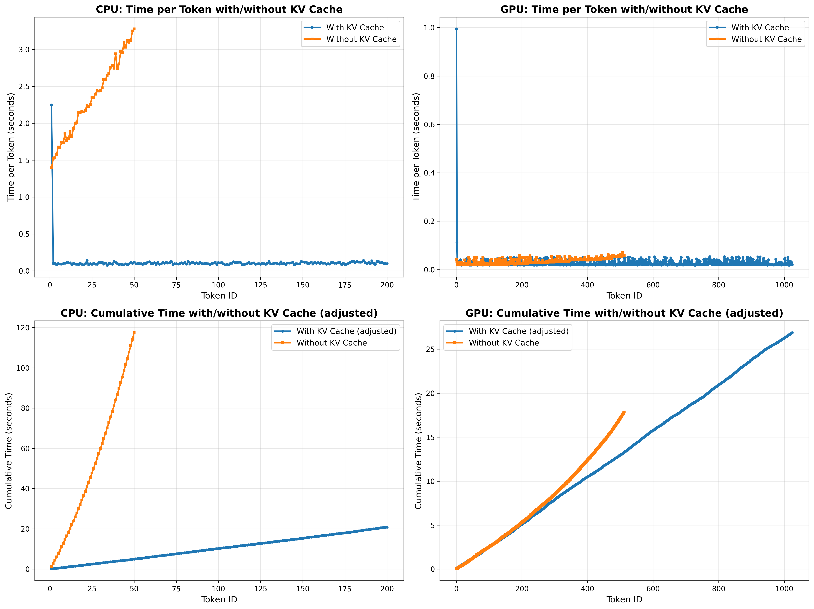

# KV Cache 性能对比实验报告

## 实验目的
对比开启和关闭 KV Cache 对模型生成性能的影响，验证 KV Cache 在加速自回归生成过程中的作用。

## 实验环境
- **设备**: CPU 和 GPU (NVIDIA GeForce RTX 3060)
- **模型**: Qwen3
- **输入提示词**: 关于人工智能发展历程、应用、挑战和趋势的详细介绍（长回答型问题）
- **最大生成长度**: 
  - CPU: 无 KV Cache 50 tokens, 有 KV Cache 200 tokens
  - GPU: 无 KV Cache 512 tokens, 有 KV Cache 1024 tokens

## 实验方法
1. 在相同输入 prompt 下，分别测试开启和关闭 KV Cache 的生成性能
2. 记录每个 token 的生成时间和累积时间
3. 对比不同设置下的 tokens/s 指标

## 性能对比结果

### 汇总表格

| Device | KV Cache | Total Tokens | Prefill Time (s) | Avg Time/Token (s) | Avg Time (no prefill) | Tokens/s | Tokens/s (no prefill) |
|--------|----------|--------------|------------------|-------------------|----------------------|----------|----------------------|
| CPU | Yes | 200 | 2.2482 | 0.115058 | 0.104339 | 8.6912 | 9.5841 |
| CPU | No | 50 | 0.0000 | 2.349927 | 2.349927 | 0.4255 | 0.4255 |
| GPU | Yes | 1024 | 0.9946 | 0.027192 | 0.026247 | 36.7752 | 38.1002 |
| GPU | No | 512 | 0.0000 | 0.034893 | 0.034893 | 28.6591 | 28.6591 |

### 性能提升

- **CPU**: 使用 KV Cache 后，性能提升 **20.42x** (不计预填充：**22.52x**)
- **GPU**: 使用 KV Cache 后，性能提升 **1.28x** (不计预填充：**1.33x**)

### 关于预填充时间的说明

使用 KV Cache 时，第一个 token 的生成时间（预填充时间）包含以下开销：
1. **KV Cache 预分配**：为后续生成预留内存空间
2. **Prompt 处理**：处理整个输入序列并生成初始 KV 值

因此，我们提供了两种性能指标：
- **包含预填充**：反映实际使用场景的端到端性能
- **不计预填充**：仅统计解码阶段的稳定生成速度，用于对比 KV Cache 的解码加速效果

### 可视化结果

*上图展示了每个 token 的生成时间和累积时间随生成 token 数量的变化趋势*

## 详细数据

### CPU 性能数据

#### 开启 KV Cache (前 10 个 token)
| Token ID | Time (s) | Cumulative Time (s) | Tokens/s |
|----------|----------|---------------------|----------|
| 1 | 2.248212 | 2.248212 | 0.4448 |
| 2 | 0.103457 | 2.351669 | 9.6659 |
| 3 | 0.099959 | 2.451628 | 10.0041 |
| 4 | 0.083578 | 2.535206 | 11.9648 |
| 5 | 0.100207 | 2.635413 | 9.9794 |
| 6 | 0.093532 | 2.728945 | 10.6915 |
| 7 | 0.092640 | 2.821585 | 10.7944 |
| 8 | 0.099943 | 2.921528 | 10.0057 |
| 9 | 0.104737 | 3.026265 | 9.5477 |
| 10 | 0.113464 | 3.139729 | 8.8134 |

#### 关闭 KV Cache (前 10 个 token)
| Token ID | Time (s) | Cumulative Time (s) | Tokens/s |
|----------|----------|---------------------|----------|
| 1 | 1.395630 | 1.395630 | 0.7165 |
| 2 | 1.518376 | 2.914006 | 0.6586 |
| 3 | 1.534675 | 4.448680 | 0.6516 |
| 4 | 1.575261 | 6.023941 | 0.6348 |
| 5 | 1.678759 | 7.702700 | 0.5957 |
| 6 | 1.667170 | 9.369870 | 0.5998 |
| 7 | 1.746390 | 11.116260 | 0.5726 |
| 8 | 1.733929 | 12.850190 | 0.5767 |
| 9 | 1.866502 | 14.716691 | 0.5358 |
| 10 | 1.767717 | 16.484408 | 0.5657 |

### GPU 性能数据

#### 开启 KV Cache (前 10 个 token)
| Token ID | Time (s) | Cumulative Time (s) | Tokens/s |
|----------|----------|---------------------|----------|
| 1 | 0.994559 | 0.994559 | 1.0055 |
| 2 | 0.113066 | 1.107625 | 8.8444 |
| 3 | 0.022513 | 1.130138 | 44.4181 |
| 4 | 0.019939 | 1.150077 | 50.1536 |
| 5 | 0.019964 | 1.170041 | 50.0901 |
| 6 | 0.033655 | 1.203696 | 29.7131 |
| 7 | 0.021908 | 1.225604 | 45.6455 |
| 8 | 0.019378 | 1.244982 | 51.6062 |
| 9 | 0.020767 | 1.265749 | 48.1534 |
| 10 | 0.019534 | 1.285283 | 51.1917 |

#### 关闭 KV Cache (前 10 个 token)
| Token ID | Time (s) | Cumulative Time (s) | Tokens/s |
|----------|----------|---------------------|----------|
| 1 | 0.041356 | 0.041356 | 24.1805 |
| 2 | 0.032743 | 0.074099 | 30.5406 |
| 3 | 0.019575 | 0.093674 | 51.0848 |
| 4 | 0.023587 | 0.117261 | 42.3971 |
| 5 | 0.028010 | 0.145270 | 35.7021 |
| 6 | 0.020373 | 0.165643 | 49.0847 |
| 7 | 0.021096 | 0.186739 | 47.4029 |
| 8 | 0.025985 | 0.212724 | 38.4839 |
| 9 | 0.020249 | 0.232973 | 49.3856 |
| 10 | 0.020036 | 0.253009 | 49.9091 |

## 结论

1. **KV Cache 显著提升性能**: 无论是 CPU 还是 GPU，使用 KV Cache 都能大幅减少每个 token 的生成时间
2. **无 KV Cache 时性能递减**: 不使用 KV Cache 时，随着生成 token 数量增加，需要重复计算所有历史 token 的 KV 值，导致生成时间逐渐增加
3. **KV Cache 的必要性**: 对于长文本生成，KV Cache 是优化推理性能的关键技术

## 实验日期
2026-03-10 08:21:19