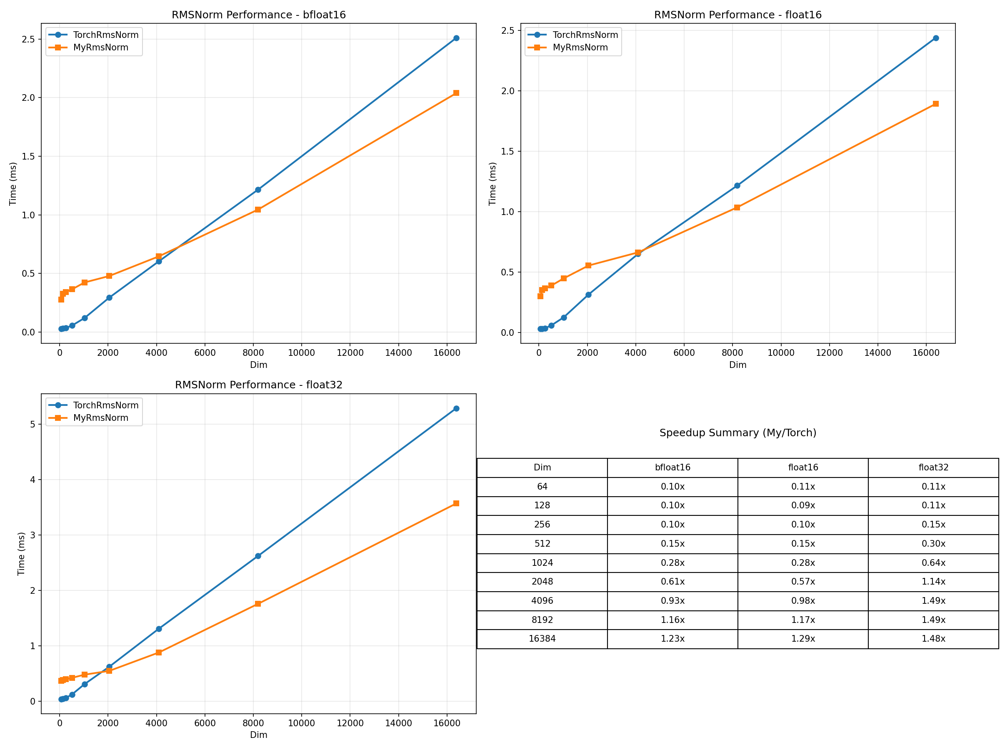
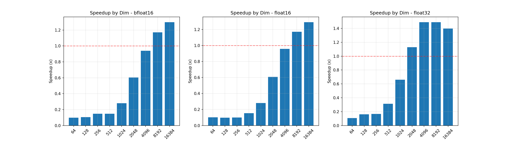

# RMSNorm CUDA 性能对比报告

## 测试环境

- **设备**: NVIDIA GeForce RTX 3060
- **PyTorch 版本**: 2.10.0+cu128
- **CUDA 版本**: 12.8
- **数据类型**: float32, float16, bfloat16

## 测试配置

- Batch Size: 16
- Seq Len: 512
- Warmup: 10 iterations
- 测试迭代: 100 iterations

## 测试结果

### bfloat16

| Dim | TorchRmsNorm (ms) | MyRmsNorm (ms) | Speedup |
|-----|-------------------|----------------|---------|
| 64 | 0.0296 | 0.3044 | 0.10x |
| 128 | 0.0374 | 0.3584 | 0.10x |
| 256 | 0.0553 | 0.3744 | 0.15x |
| 512 | 0.0592 | 0.4006 | 0.15x |
| 1024 | 0.1293 | 0.4633 | 0.28x |
| 2048 | 0.3188 | 0.5286 | 0.60x |
| 4096 | 0.6668 | 0.7104 | 0.94x |
| 8192 | 1.3443 | 1.1483 | 1.17x |
| 16384 | 2.6929 | 2.0718 | 1.30x |

### float16

| Dim | TorchRmsNorm (ms) | MyRmsNorm (ms) | Speedup |
|-----|-------------------|----------------|---------|
| 64 | 0.0306 | 0.2955 | 0.10x |
| 128 | 0.0342 | 0.3548 | 0.10x |
| 256 | 0.0366 | 0.3689 | 0.10x |
| 512 | 0.0601 | 0.3929 | 0.15x |
| 1024 | 0.1280 | 0.4553 | 0.28x |
| 2048 | 0.3178 | 0.5230 | 0.61x |
| 4096 | 0.6608 | 0.6901 | 0.96x |
| 8192 | 1.3385 | 1.1409 | 1.17x |
| 16384 | 2.6939 | 2.0828 | 1.29x |

### float32

| Dim | TorchRmsNorm (ms) | MyRmsNorm (ms) | Speedup |
|-----|-------------------|----------------|---------|
| 64 | 0.0417 | 0.3856 | 0.11x |
| 128 | 0.0626 | 0.3878 | 0.16x |
| 256 | 0.0633 | 0.3768 | 0.17x |
| 512 | 0.1258 | 0.4001 | 0.31x |
| 1024 | 0.3076 | 0.4649 | 0.66x |
| 2048 | 0.6299 | 0.5574 | 1.13x |
| 4096 | 1.3338 | 0.8944 | 1.49x |
| 8192 | 2.6636 | 1.7867 | 1.49x |
| 16384 | 5.0188 | 3.5878 | 1.40x |

## 分析

### bfloat16
- **平均 Speedup**: 0.53x
- **最佳 Dim**: 16384 (Speedup: 1.30x)
- **最差 Dim**: 64 (Speedup: 0.10x)

### float16
- **平均 Speedup**: 0.53x
- **最佳 Dim**: 16384 (Speedup: 1.29x)
- **最差 Dim**: 128 (Speedup: 0.10x)

### float32
- **平均 Speedup**: 0.77x
- **最佳 Dim**: 4096 (Speedup: 1.49x)
- **最差 Dim**: 64 (Speedup: 0.11x)

## 结论

- **bfloat16**: TorchRmsNorm 平均快 1.88x
- **float16**: TorchRmsNorm 平均快 1.89x
- **float32**: TorchRmsNorm 平均快 1.30x

## 性能图表

