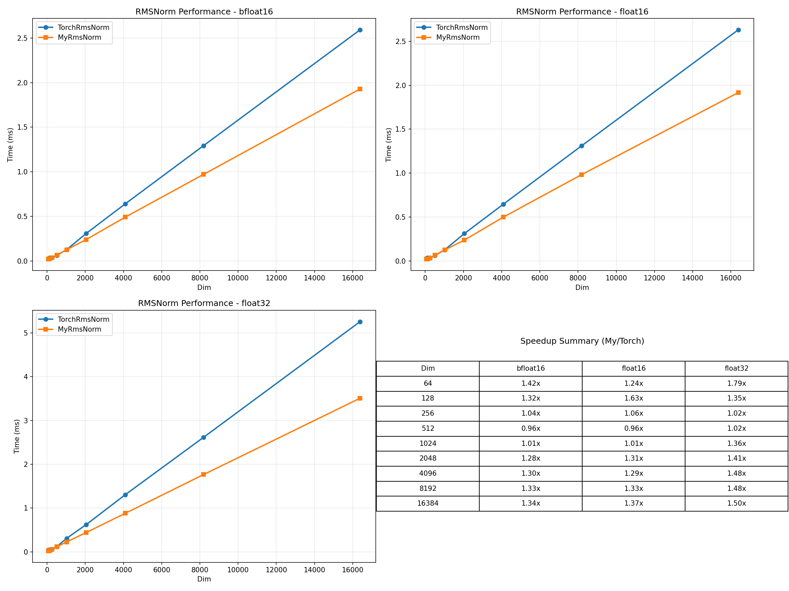
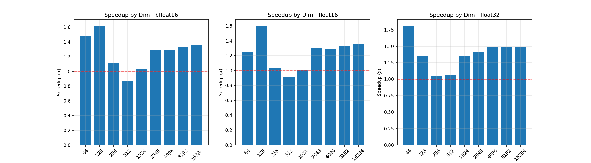

# RMSNorm CUDA 性能对比报告

## 测试环境

- **设备**: NVIDIA GeForce RTX 3060
- **PyTorch 版本**: 2.10.0+cu128
- **CUDA 版本**: 12.8
- **数据类型**: float32, float16, bfloat16

## 测试配置

- Batch Size: 16
- Seq Len: 512
- Warmup: 10 iterations
- 测试迭代: 100 iterations

## 测试结果

### bfloat16

| Dim | TorchRmsNorm (ms) | MyRmsNorm (ms) | Speedup |
|-----|-------------------|----------------|---------|
| 64 | 0.0299 | 0.0202 | 1.48x |
| 128 | 0.0367 | 0.0226 | 1.62x |
| 256 | 0.0403 | 0.0363 | 1.11x |
| 512 | 0.0590 | 0.0678 | 0.87x |
| 1024 | 0.1297 | 0.1249 | 1.04x |
| 2048 | 0.3137 | 0.2444 | 1.28x |
| 4096 | 0.6517 | 0.5022 | 1.30x |
| 8192 | 1.3216 | 0.9961 | 1.33x |
| 16384 | 2.6322 | 1.9424 | 1.36x |

### float16

| Dim | TorchRmsNorm (ms) | MyRmsNorm (ms) | Speedup |
|-----|-------------------|----------------|---------|
| 64 | 0.0294 | 0.0234 | 1.26x |
| 128 | 0.0369 | 0.0230 | 1.60x |
| 256 | 0.0366 | 0.0355 | 1.03x |
| 512 | 0.0595 | 0.0655 | 0.91x |
| 1024 | 0.1293 | 0.1276 | 1.01x |
| 2048 | 0.3165 | 0.2427 | 1.30x |
| 4096 | 0.6525 | 0.5041 | 1.29x |
| 8192 | 1.3146 | 0.9885 | 1.33x |
| 16384 | 2.6375 | 1.9409 | 1.36x |

### float32

| Dim | TorchRmsNorm (ms) | MyRmsNorm (ms) | Speedup |
|-----|-------------------|----------------|---------|
| 64 | 0.0446 | 0.0246 | 1.81x |
| 128 | 0.0427 | 0.0316 | 1.35x |
| 256 | 0.0624 | 0.0596 | 1.05x |
| 512 | 0.1264 | 0.1198 | 1.06x |
| 1024 | 0.3124 | 0.2318 | 1.35x |
| 2048 | 0.6353 | 0.4500 | 1.41x |
| 4096 | 1.3290 | 0.8964 | 1.48x |
| 8192 | 2.6613 | 1.7859 | 1.49x |
| 16384 | 5.3098 | 3.5697 | 1.49x |

## 分析

### bfloat16
- **平均 Speedup**: 1.27x
- **最佳 Dim**: 128 (Speedup: 1.62x)
- **最差 Dim**: 512 (Speedup: 0.87x)

### float16
- **平均 Speedup**: 1.23x
- **最佳 Dim**: 128 (Speedup: 1.60x)
- **最差 Dim**: 512 (Speedup: 0.91x)

### float32
- **平均 Speedup**: 1.39x
- **最佳 Dim**: 64 (Speedup: 1.81x)
- **最差 Dim**: 256 (Speedup: 1.05x)

## 结论

- **bfloat16**: MyRmsNorm 平均快 1.27x
- **float16**: MyRmsNorm 平均快 1.23x
- **float32**: MyRmsNorm 平均快 1.39x

## 性能图表

